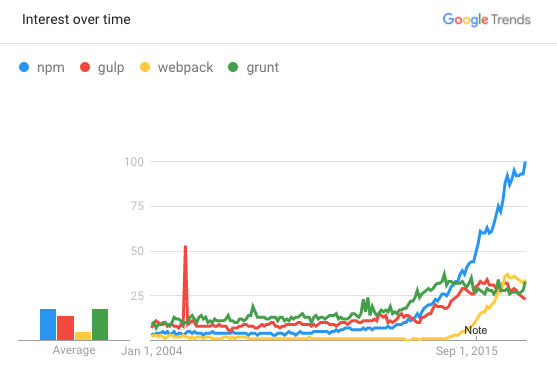
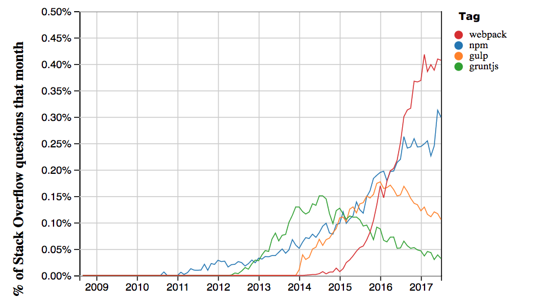
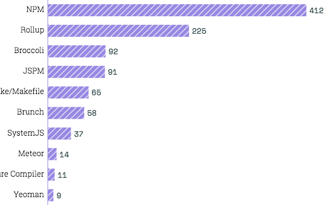

# 为什么选择 npm script？

为什么要选择 npm script？

如果在心里这么问自己，因为理性的选择都应该从为什么开始。在小册介绍中我提到的重量级构建工具所带来的问题，已有前人总结的非常不错，吐血推荐大家阅读原文：[Why I left gulp and grunt for npm scripts](https://medium.freecodecamp.org/why-i-left-gulp-and-grunt-for-npm-scripts-3d6853dd22b8)，中译版也有。

在软件工程里面有个重要的原则，就是简单性，越是简单的东西越是可靠，从概率论的角度，任何系统环节越多稳定性越差。

npm script 相比 grunt、gulp 之类的构建工具简单很多，因为它消除了这些构建工具所带来的抽象层，并带给我们更大的自由度。随着社区的发展，各种基础工具都可以信手拈来，只要会使用 [npmjs.com](https://www.npmjs.com) 去搜索，或者去 [libraries.io](https://libraries.io) 上搜索。

## Google Trends

第 1 组数据来自 [Google Trends](https://trends.google.com/trends/explore?date=all&q=npm,gulp,webpack,grunt)，如果你想了解任何事物的长期发展趋势，Google Trends 是个非常不错的工具。

图中是 Google 上的 grunt、gulp、webpack、npm 等 4 种工具的搜索量呈现的趋势，npm 无疑是非常值得前端工程师关注的，而真正让他`强大到无所不能（夸张说法）`的 npm script 是不是应该熟练掌握？

## Stack Overflow Trends

第 2 组数据来自 [Stack Overflow Trends](https://insights.stackoverflow.com/trends?tags=npm%2Cgulp%2Cgruntjs%2Cwebpack)，就是那个遇到任何技术问题都可以去找答案的问答社区。

图中是 4 种工具逐月问题数在全部问题总数中的占比，虽然整体比例比较小，但是从趋势来看，webpack、npm 依然是值得的关注的技术。

## The State of JS Survey 2016

第 3 组数据来自 [The State of JS Survey 2016](https://stateofjs.com/2016/buildtools) 年度调查的结果，虽然 npm script 在 javascript 开发者中接受度没有排到前四名（webpack、grunt、gulp、browserify），但是在其他项中名列前茅，个人也比较好奇今年的实际表现（统计结果还没出来）。

